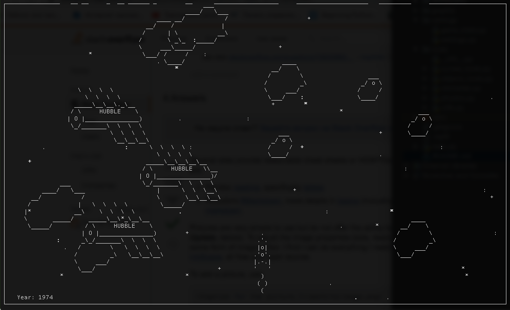

### Spaceship game in console



This game is a part of [Devman](https://dvmn.org) course of [async python](https://dvmn.org/modules/async-python/).<br>
Using: asyncio, curses.

Play now: [](https://repl.it/github/ekbdizzy/spaceship_game)

***

### How to install

Required Python version > 3.6

```
git clone https://github.com/ekbdizzy/spaceship_game.git
cd spaceship_game
python3 main.py
```
